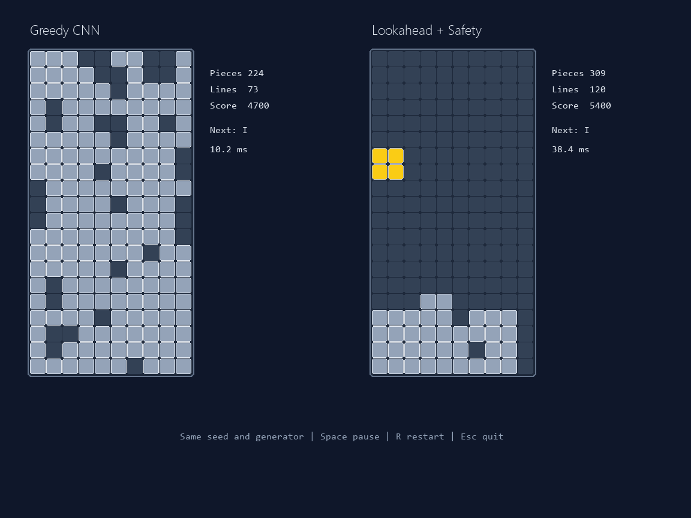
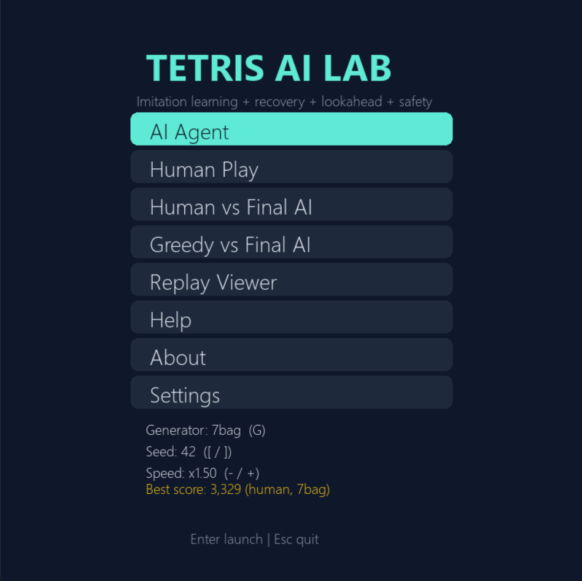
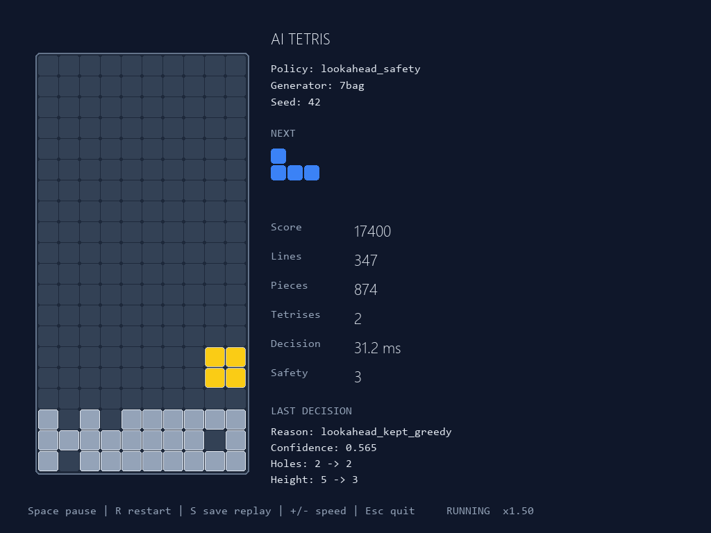
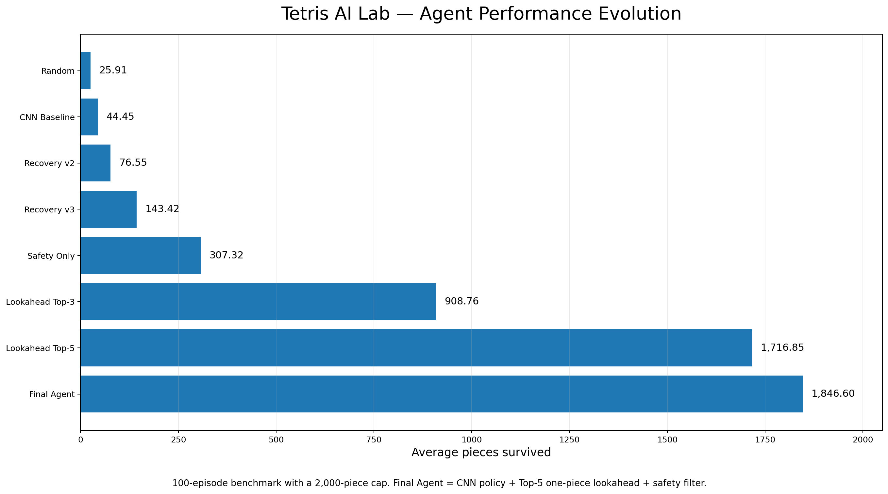
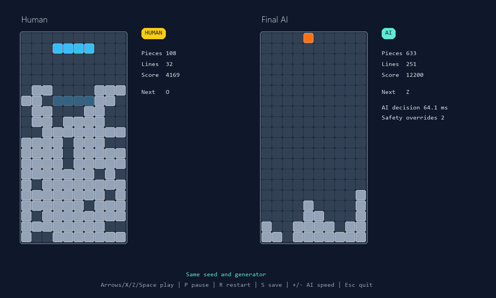
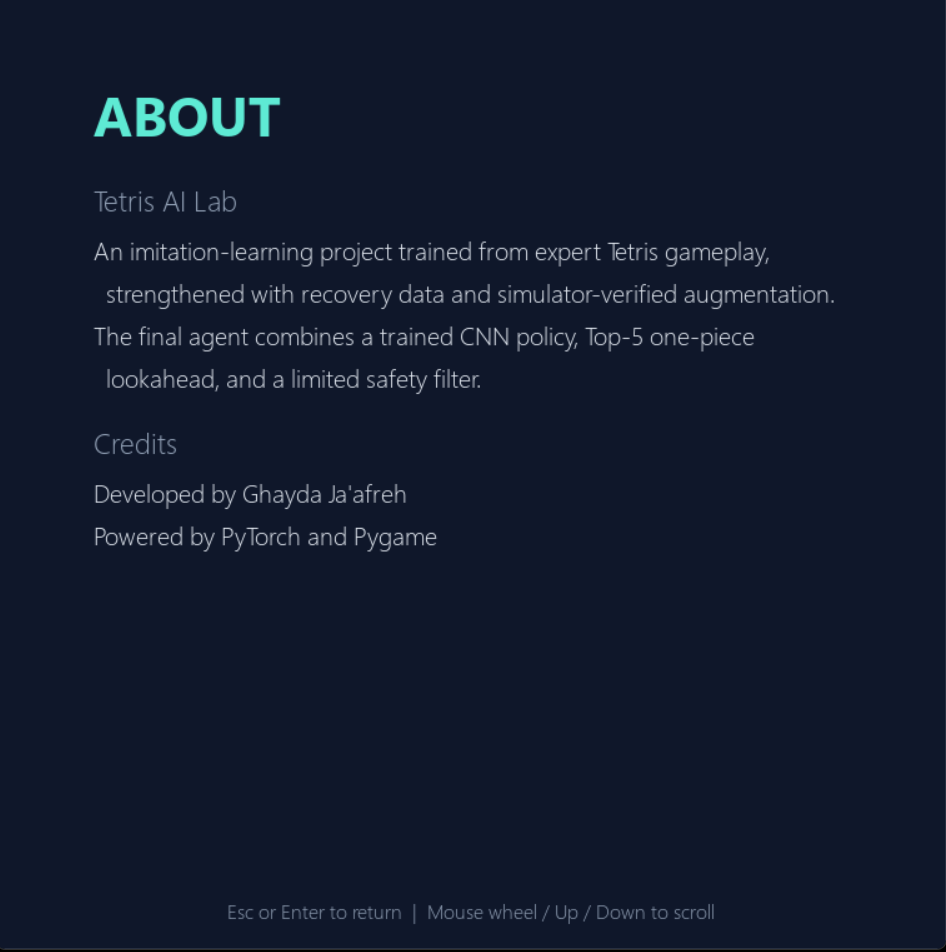

# Tetris AI Lab

An AI-powered Classic Tetris project that learns placement decisions from tournament footage, improves recovery through simulator-generated difficult states, and deploys the resulting agent in an interactive Windows application.

**Developed by Ghayda Ja'afreh**  
Powered by PyTorch and Pygame.

> **Public release notice:** This repository contains project documentation, benchmark results, application screenshots, and downloadable Windows releases. The proprietary source code, datasets, trained-model development pipeline, and internal development artifacts are maintained privately and are not included in this public repository.



*Under the same seed and piece generator, the Greedy CNN reaches a terminal
board after 224 pieces, while the final Lookahead + Safety agent continues
with a controlled board beyond 300 pieces.*

## Download and run

Download the latest Windows release:

**[Download Tetris AI Lab v1.0.0](https://github.com/ghayda-njaafreh/tetris-ai-lab/releases/tag/v1.0.0)**

1. Download `TetrisAILab-Windows-CPU.zip`.
2. Extract the complete ZIP file.
3. Open the extracted `TetrisAILab` folder.
4. Run `TetrisAILab.exe`.

Python and a dedicated NVIDIA GPU are not required.

## Project highlights

- Video-to-dataset pipeline for 20×10 Classic Tetris boards.
- Strict code-based data cleaning and leakage-resistant video-level splits.
- CNN imitation policy with legal-action masking.
- Recovery/DAgger-style training using simulator-generated difficult states.
- Simulator-verified horizontal reflection augmentation.
- Top-5 one-piece lookahead and a limited safety filter.
- Benchmarks across Uniform, NES-approximate, and 7-bag piece generators.
- Interactive AI, human, comparison, versus, replay, settings, audio, and screenshot modes.
- Portable CPU-only Windows distribution.

## Application interface



*The Windows application includes AI play, human play, head-to-head comparison,
replay viewing, themes, audio, help, and settings.*

## Final agent

```text
CNN policy_recovery_v3
+ Top-5 one-piece lookahead
+ Safety filter
```

The learned model predicts one of 40 final placements (`4 rotations × 10 columns`). Illegal placements are masked before selection. The final agent reranks the model's strongest candidates using one-piece lookahead and applies a limited safety override only in risky states.

The final application is therefore a **hybrid agent**, not a pure CNN-only system.



*The final Lookahead + Safety agent maintains a low, controlled board after
874 pieces and 347 cleared lines using the 7-bag generator with seed 42.*

## Verified results

### Offline test set

The independent test set contains 9,180 samples from videos excluded from training.

| Metric | Result |
|---|---:|
| Test loss | 1.0539 |
| Top-1 accuracy | 68.43% |
| Top-3 accuracy | 89.59% |

### Closed-loop gameplay

| Benchmark | Greedy CNN | Final agent |
|---|---:|---:|
| Uniform, 100 games, 2,000-piece cap | 143.42 mean pieces | 1,846.60 mean pieces |
| Uniform, 30 games, 10,000-piece cap | — | 5,985.67 mean pieces |
| NES-approx, 30 games, 10,000-piece cap | — | 7,964.50 mean pieces |
| 7-bag, 30 games, 10,000-piece cap | — | 10,000 mean pieces; 100% reached cap |

These are capped simulator benchmarks, not claims about official competitive Classic Tetris performance.

## Performance evolution



*Performance improved progressively from the pure CNN baseline to the final
hybrid agent combining Top-5 one-piece lookahead and a limited safety filter.*

## Dataset preparation

The private development pipeline produced the following strict cleaning report:

```text
Raw samples:                 58,636
Accepted clean samples:      57,496
Removed samples:              1,140
Semantic duplicates removed:    720
Missing board files:              0
Train / validation / test: 39,367 / 8,949 / 9,180
```

Cleaning included:

- development-test source exclusion;
- exact-match and zero-cell-error requirements;
- ambiguity rejection;
- board-file validation;
- semantic duplicate removal;
- deterministic video-level splitting with seed 42.

The v3 training set contains 79,717 samples after recovery data and simulator-verified mirror augmentation. All 26,572 requested mirrored samples were created with zero mapping failures.

The private development project contains the recovery-data generation, simulator-verified augmentation, model-training, and evaluation pipelines used to produce the final policy. These proprietary implementation files are not included in the public repository.

## Application modes

The Windows application includes:

- **AI Agent** — the final CNN + lookahead + safety agent plays automatically.
- **Human Play** — real-time falling pieces with keyboard controls.
- **Human vs Final AI** — human and AI use the same seed and piece generator.
- **Greedy vs Final AI** — visual comparison between direct CNN argmax and the final hybrid agent.
- **Replay Viewer** — view saved games.
- **Settings** — sound, volume, theme, fullscreen, seed, speed, and generator options.

## Human vs Final AI



*Human and Final AI play with the same seed and piece generator. The final
agent remains stable after more than 600 pieces while the human board
approaches a critical state.*

## Human controls

| Key | Action |
|---|---|
| Left / Right | Move piece |
| Up or X | Rotate clockwise |
| Z | Rotate counter-clockwise |
| Down | Soft drop |
| Space | Hard drop |
| P | Pause where supported |
| R | Restart with the same seed |
| S | Save replay |
| F12 | Save screenshot |
| Esc | Return or quit |

## Method summary

1. Tournament footage was processed into stable 20×10 board states.
2. Candidate tetromino placements were simulated and matched against observed next boards.
3. Strict automated cleaning removed ambiguous, erroneous, development-test, and duplicate samples.
4. A CNN policy learned final placement decisions with legal-action masking.
5. Recovery training added difficult states visited by the model itself.
6. Horizontal reflection augmentation was accepted only when the mirrored label was exactly verified by the simulator.
7. Top-5 one-piece lookahead reranked strong CNN candidates.
8. A limited safety filter prevented rare catastrophic placements.

## Responsible use and limitations

- Tournament footage should only be processed when its use is permitted.
- Source clips and broadcast-derived images should not be redistributed without appropriate permission.
- `nes_approx` is an explicitly approximate generator and not a cycle-accurate NES RNG implementation.
- Gameplay results depend on the project's simulator, action representation, generator, caps, seed range, and safety settings.
- The final agent is hybrid: the CNN is learned, while lookahead and safety use simulator-based board evaluation.
- The public Windows build is provided for demonstration and evaluation only.

## Documentation

- [`PROJECT_REPORT.md`](PROJECT_REPORT.md) — methodology, experiments, findings, and limitations.
- [`FINAL_PROJECT_GUIDE.md`](FINAL_PROJECT_GUIDE.md) — quick demonstration guide for the Windows release.
- [`CHANGELOG.md`](CHANGELOG.md) — public release history.
- [`NOTICE.md`](NOTICE.md) — ownership, distribution, and trademark notice.
- [`LICENSE`](LICENSE) — all-rights-reserved terms.


## About the application



*The About screen presents the project identity, core methods, and developer
credit for the public Windows release.*

## Ownership and licensing

Copyright © 2026 Ghayda Ja'afreh. All rights reserved.

The complete proprietary source code, datasets, model-development pipeline, and internal artifacts are not published in this repository. No permission is granted to copy, modify, redistribute, sublicense, sell, publish, reverse engineer, or reuse the project without prior written permission.
